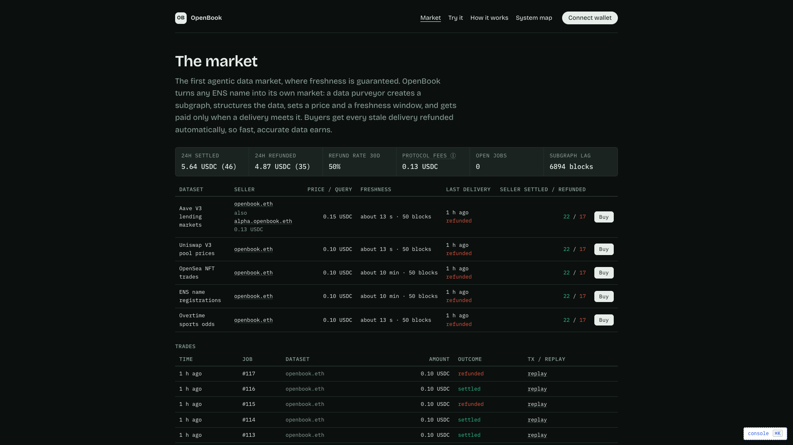
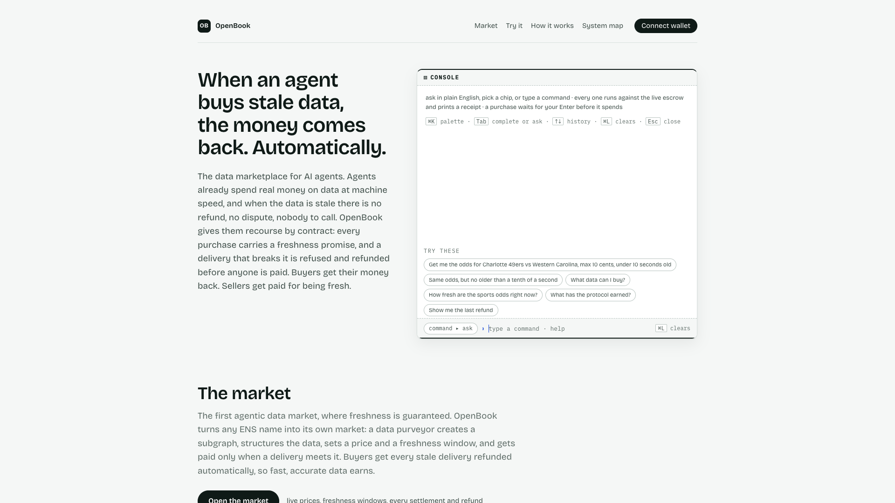

# OpenBook: The Data Marketplace for AI Agents

[](https://github.com/Aliserag/OpenBook/actions/workflows/ci.yml)

> **The data marketplace for AI agents, with automatic refunds for every stale delivery.**
> Sellers are ENS names. Buyers pay into an escrow on Arc with a freshness promise written
> in. Deliveries arrive through The Graph stamped with their indexed block. A contract
> compares the stamp with the promise and pays the seller, or refunds the buyer.
> Built for ETHOnline 2026 (Sep 4–16).

[](https://www.youtube.com/watch?v=OLUNTuVyvac)

| | |
| --- | --- |
| **Demo video** (3:55) | https://www.youtube.com/watch?v=OLUNTuVyvac |
| **Live app**, no wallet needed | https://openbook.litai.ca |
| **The market** | https://openbook.litai.ca/#market |
| **Architecture** | [docs/architecture.md](docs/architecture.md) |

**Bounties targeted (one project, three sponsors):**
- **Arc: Best DeFi/Onchain Finance Application** ($3,500; +$2,500 for a mainnet deployment by Sep 30). Circle tools in the money path: Arc with USDC as gas, the ERC-8183 reference escrow with our SlaHook, Circle Wallets (developer-controlled SCA buyer and seller), Circle Gas Station, App Kit Bridge and Gateway for treasury funding, and an x402 pay-per-call lane through Circle Nanopayments.
- **The Graph: Best AI Tooling or AI Use Case with The Graph (Start Fresh)** ($5,000 pool)
- **ENS: Best Use of ENSv2** ($4,500)

## The pitch

Agents already spend real money on data at machine speed, and when the data is stale there
is no refund, no dispute, nobody to call. Bad data costs the average organization
[$12.9M a year](https://www.ibm.com/think/topics/data-quality) (Gartner, via IBM),
[54% of organizations are deploying AI agents](https://kpmg.com/us/en/media/blogs/2026/q1-ai-pulse-3.html)
(KPMG, Q1 2026), and Gartner expects
[more than 40% of agentic AI projects to be canceled by 2027](https://www.gartner.com/en/newsroom/press-releases/2025-06-25-gartner-predicts-over-40-percent-of-agentic-ai-projects-will-be-canceled-by-end-of-2027),
naming inadequate risk controls among the reasons. The rails exist. The recourse does not.

**Recourse is the missing primitive of the agentic economy.** OpenBook is the data
marketplace for AI agents, with automatic refunds for every stale delivery: the first market
where the payment undoes itself, by contract, if the data is not what was promised.
**Sellers are ENS names** (an ENSv2 name or subname with four text records that price and
reprice themselves), **agents compare**, **the escrow enforces** the freshness promise
committed at payment time, and **the protocol takes 2%** of every settlement. Buyers get
recourse they can verify without trusting the seller. Sellers get a freshness guarantee they
can charge for.

**The mechanic: SLA-bound payments.** Every query is an ERC-8183 job on Arc with the
conditions packed in at payment time: the freshness block floor, the deliverable hash, the
deadline. The delivery arrives through The Graph with its indexed block. Our `SlaHook`
compares the block with the floor before any payout. Clear it and `complete()` pays 98% to
the seller and 2% to the protocol. Miss it and the hook reverts `SlaNotMet`; the escrow
refunds the buyer in the same step, onchain.

**Both outcomes are in the video, signed from a plain browser wallet on the live escrow:**
job 116 asked for sports odds fresh within 10 seconds and settled
([0x769685cd…4cc2fd](https://testnet.arcscan.app/tx/0x769685cdda5a6df5606baef78241ce6a065ad89193f0b4641afc33e9644cc2fd):
0.098 USDC to the seller, 0.002 USDC to the treasury); job 117 asked for the same odds no
older than a tenth of a second, the delivery arrived three seconds old, and the contract
refused and refunded the full 0.10 USDC
([0x39d92b9e…db6012](https://testnet.arcscan.app/tx/0x39d92b9e041a3bf7065a1718d876aec21df7bf7914fc4814ad8e8fbd47db6012)).
Every settlement, refund and fee is indexed by our `open-book` subgraph into public books
([the market](https://openbook.litai.ca/#market); [raw subgraph](https://api.studio.thegraph.com/query/1760032/open-book/v0.0.8)).



## FAQ: what exactly is being sold, and to whom

**Onchain data only, or any data?** The reference deployment sells
**subgraph-queried, onchain-indexed data**: any of The Graph's 15,000+
subgraphs becomes a sellable dataset with one config entry (`mcp/config/`).
The mechanism itself generalizes to **any feed that can be timestamped and
hashed**, prices, sports odds, weather, news: the SLA binds whatever the
seller can attest. Selling offchain research would need a trustworthy
freshness attestation for that source, which is the buyer's call to accept;
the shipped configs only claim what they can attest onchain.

**How is this different from an oracle?** Oracles *push* a feed into a
contract; you pay to publish. OpenBook is *pull*: a buyer pays per query and
the seller owes a spec (freshness floor, deliverable hash, deadline) enforced
by an escrow that refunds when the spec is missed. The product is not "better
data access"; it is **recourse** for machine-to-machine purchases.

**Why would anyone pay when they can query raw?** Raw queries give you data;
they don't give you (1) a counterparty who owes you a verifiable promise,
(2) a refund that executes without a support ticket, or (3) a payee whose books
are public. The target buyer is autonomous software and the teams running it:
trading/execution agents, risk monitors, settlement bots, where one stale
answer costs more than the query, and where nobody can open a dispute at 3am.

## Architecture


Rendered from the mermaid source in [docs/architecture.md](docs/architecture.md) (that file
carries the full flow, the deterministic demo path, and the trust model). The three sponsors
are organs, not stickers:

- **Arc (rail + cash register):** ERC-8004 agent identity, USDC nanopayments, ERC-8183
  escrow settlement, custom policy-gated treasury (`PolicyWallet.sol` with onchain
  `PolicyBlocked` events. Circle's built-in policies are mainnet-only; ours is the
  testnet-demoable path), and **onchain SLA adjudication** (`SlaHook.sol`, an
  EIP-8183 hook that blocks `complete()` unless the freshness proof covers the
  submitted deliverable and clears the floor; proven live: a stale completion
  reverts `SlaNotMet`, the refund path stays open). Wired through the shipped
  CLI: `--hook <addr>` + `OPENBOOK_ESCROW`/`OPENBOOK_HOOK`, a hooked job's
  settlement is enforced onchain, end to end, with the stock binary.
  **Sustainable by construction:** a configurable platform fee (2% on our
  escrow instance) routes every settlement's cut to the policy-gated treasury,
  verified onchain: the settlement receipt splits 0.0020 USDC to the
  PolicyWallet and 0.0980 to the seller ([tx `0xb4fbc894…`](https://testnet.arcscan.app/tx/0xb4fbc8949598c9d940a8152618d891c545ab3be2cca94db9886fca07810c5512)).
- **The Graph (the product):** `sla-subgraph-mcp`, a generic MCP server with a
  packaged, node-runnable bin (npm publishing is the one-line post-freeze step)
  that turns any subgraph into a paid, freshness-gated product; OpenBook is the reference
  deployment. Seven tools, including `discover_datasets` (The Graph's official Subgraph MCP as the catalog, one paste-ready config entry per hit) and `choose_seller`: the buyer-side decision that reads every
  seller's live ENS terms and the dataset's index lag right now, drops sellers whose promised
  window the index cannot meet, and picks the cheapest or the freshest, with its reasoning. **The difference from a read-only MCP wrapper is where the freshness gate
  sits: it decides whether money moves.** Stale data is never charged, and a missed SLA
  refunds the buyer onchain, provenance that *costs* the seller, not a footnote on an
  answer. Plus the `open-book` Studio subgraph on **arc-testnet** indexing every
  payment/refund/policy event, the agent's audited books.
- **ENS (storefront + business license):** `openbook.eth` on ENSv2 Sepolia publishes menu,
  pricing, SLA, and payee as text records; buyers hard-fail without resolution
  ("No ENS, no payment"). The `svc.payee` record names the seller wallet the
  page settles to (a Circle wallet; the server re-resolves it and the price from ENS
  before every job and refuses mismatches), and the protocol fee goes to the policy-gated
  treasury through the escrow's fee split. The agent also runs its **own ENSv2 subname registry**
  (UserRegistry via the VerifiableFactory): a dataset can be its own subname,
  `aave-v3-arbitrum-lending.openbook.eth` prices itself at 0.15 while the parent
  quotes 0.10, and the quote reads the most specific records through the
  hierarchical registry. `alpha.openbook.eth` has no resolver of its own and
  resolves through the parent's (wildcard resolution).
- **Delegated record editing, live.** The parent owner granted alpha's own key the right to
  edit one record on its own node
  ([`authorizeTextRoles(alpha, "svc.price", 0xe09C…, true)`](https://sepolia.etherscan.io/tx/0x09589d0ed2d14d5b64181b41f6d38c9a4c069de1d21354addbcc7d97873b2f86)),
  and alpha repriced itself from 0.12 to 0.13 USDC/query with that key
  ([setText tx](https://sepolia.etherscan.io/tx/0x0b2c133612a735ff69a86cab43c8aabcc231adcf7af4113726f30269d41edac2)).
  Everything else still reverts `EACUnauthorizedAccountRoles` (`0x4b27a133`): alpha writing
  `svc.sla` (not granted), an unrelated address writing alpha's `svc.price`, alpha writing the
  parent's `svc.price`. Reproduce in the page's console with `ens can-edit <name> <key> <address>`
  (an `eth_call` of `setText` from that address: allowed, or `EACUnauthorizedAccountRoles`), or
  grant and prove a delegation yourself with `scripts/ens/delegate.sh <subname> <key> <address>`
  against resolver `0x59d9d95e8dEC7745a3A4243dB45458bfE513b0a3` on Sepolia.

## The app

Open [https://openbook.litai.ca](https://openbook.litai.ca) and you are standing in the
marketplace. Two pages, every figure read live from ENS, the `open-book` subgraph and the
Arc escrow:

1. **The console, open.** The hero is the console, with a clean tape and the chips under
   it as the call to action; the paragraph beside it states the problem (no refund, no
   dispute, nobody to call) and the promise. Purchases run through a Circle
   developer-controlled wallet (gas sponsored by Circle Gas Station) or the visitor's own
   connected wallet; after each receipt the chips lead to the next move.
   Nineteen commands, `help` lists them, and plain English works: anything that is not a
   command goes to the server model, which picks the command (read-only ones run at once).
   "get me the odds for Charlotte 49ers vs Western Carolina, max 10 cents" becomes
   `buy overtime-sports-odds --match "Charlotte 49ers" --max 0.10`, the console asks how fresh
   the data must be, "under 10 seconds" answers it, and one receipt prints the match and its
   odds, the floor, fund, submit and the verdict (job 114); "now get me the same data but no older than a tenth of a
   second" is a real purchase no seller can meet: the freshness window is measured at
   delivery (data fetched first, floor = chain head minus the window), the delivery lands
   below the floor and the contract refuses and refunds (job 115: data 3.5 s old, window
   0.1 s, measured against the clock: Arbitrum's newest block is already over a second old); "show all available data markets" lists the datasets. `--max` caps the spend,
   `--fresh` turns seconds into the block window the contract enforces.
2. **The market, its own page** ([openbook.litai.ca/#market](https://openbook.litai.ca/#market)),
   a dark exchange screen: a ticker strip (24h settled and refunded volume, 30-day refund
   rate, protocol fees, open jobs, subgraph lag), an order book with one row per dataset
   (seller ENS name, price per query and freshness window read live from ENS, other
   sellers' asks, last delivery, settled/refunded counts, a Buy button that runs the
   console) and a trades tape of the newest jobs. The landing page carries the ticker
   strip as a teaser.
3. **Try it, with buttons.** The same purchase as a six-row stepper: pick a dataset, see
   the ENS price and the freshness promise in plain words, click **Buy**; **Make it fail**
   runs the same purchase with the floor one block above the delivery: the hook refuses
   (`SlaNotMet`) and the escrow refunds, in the same click.
4. **How it works.** Arc, The Graph and ENS in plain words, the MCP quickstart, the
   system map.



**Reliability.** Subgraph Studio rate-limits the public query endpoint per caller, so
both hosting lanes serve a same-origin cached proxy at `/api/subgraph`
(`app/public/_worker.js` on Cloudflare Pages, `app/public/api/subgraph.js` on Vercel):
fresh answers are cached 20 seconds and the last good copy is served, labeled, if Studio
answers 429. The page makes one subgraph poll per 20 seconds for all its sections.

**Two lanes, one bundle.** [https://openbook.litai.ca](https://openbook.litai.ca) is the
canonical URL (Cloudflare Pages, and the ENS `agent-endpoint[web]` record);
[https://ethonline2026-openbook.vercel.app](https://ethonline2026-openbook.vercel.app) is
the backup alias. `scripts/deploy-app.sh` publishes both from the same `dist/` and
verifies the bundles and the proxy before it reports PASS. `scripts/app-audit.mjs` is the
release gate: 20 browser assertions over the live page (hero, try it, market, books,
console, overflow at three widths, font floor, console errors).

**The console (`⌘K`)** is still there for judges who want the raw surfaces: 19 commands in
three families, **inspect** (read every live surface), **act** (transact as the demo
buyer), **sandbox** (safe re-enactments on the same live contracts).

| family | command | what it does |
| --- | --- | --- |
| inspect | `help` | list every command (`help <cmd>` for one line) |
| inspect | `status` | one-shot health: arc head, subgraph lag, ENS storefront, gateway key, demo wallet |
| inspect | `ens show` | live `svc.*` storefront records of `openbook.eth` |
| inspect | `datasets` | the storefront menu: 5 datasets with live ENS prices + SLA windows |
| inspect | `quote` | ENS-priced quote + SLA floor (live reads, no tx) |
| inspect | `books` | the books: settled, refunded, protocol fees over our jobs, plus the rows (subgraph) |
| inspect | `jobs` | scoped job table from the subgraph |
| inspect | `job` | one job's detail: paid → fulfilled → settled/refunded |
| inspect | `lag` | arc head vs subgraph indexed block (freshness ruler) |
| inspect | `policy show` | PolicyWallet caps/spend + allowlist, read live from the contract |
| inspect | `replay` | the six-frame theater for a job (quote/pay/deliver/verdict/money/books) |
| act | `buy` | fund an ERC-8183 job at the live ENS price (Circle wallets on the deployed site; demo key or connected wallet locally) |
| act | `deliver` | capture the gateway payload hash + freshness block and submit it onchain |
| act | `settle` | attest the delivery, verify + settle onchain, print verdict + fee split |
| sandbox | `policy refusals` | real `PolicyBlocked` rows from the subgraph (`PER_TX_CAP` / `DAILY_CAP` / `NOT_ALLOWLISTED`) |
| sandbox | `policy try-overspend` | simulated cap check: mirror of `checkWithdrawal` over live contract caps, no tx sent |
| sandbox | `sandbox stale [dataset]` | floor pinned one block above the delivery so `complete()` reverts `SlaNotMet`; on the deployed site the attester refunds in the same step |
| sandbox | `sandbox claim` | execute `claimRefund` for real after the deadline (live countdown) |

**Buy with your own wallet.** "Connect wallet" in the top bar connects a browser wallet on
Arc testnet (a dismissable banner links the faucet for testnet USDC). Once connected, the
console's `buy` runs the marketplace purchase from that wallet: the wallet opens the job
naming the ENS payee (the seller's Circle wallet) as provider and the hook's attester as
evaluator, the seller quotes it through `/api/circle/budget` (setBudget, gas sponsored),
then the wallet approves and funds. Three signatures, gas in Arc's native USDC. `deliver`
then has the seller's wallet submit and `settle` has the attester pay or refund, exactly
as for a keyless purchase. Verified on 2026-09-13 with job 105 (an outside wallet as buyer,
settled APPROVE).

**Who signs what (no key in the browser).** The Buy and Make it fail buttons sign
nothing: the buyer is a Circle developer-controlled SCA wallet on Arc testnet and the seller
is a second one, both driven from the page's server routes (`/api/circle/job`,
`/api/circle/submit`, `/api/circle/budget`, see `app/worker/circle.ts`) through Circle's API with a fresh entity
secret ciphertext per request, and their gas is paid by Circle Gas Station (the Arc testnet
policy). The buyer opens and funds the job, the seller sets the budget and submits the
deliverable the attester signed, so every page purchase pays a different party: the
dataset's ENS `svc.payee` names the seller wallet. The buyer holds testnet USDC as play
money; `scripts/circle/recycle.ts` moves the seller's earnings back to it. The console's
act and sandbox commands (`buy`, `deliver`, `settle`, `sandbox stale`) take the same Circle
path on the deployed site, so the whole purchase can be driven from the console with no key;
they sign locally with `VITE_DEMO_BUYER_KEY` only in local dev (the production bundle carries
no key). The SLA hook's attester is a third key that never reaches the browser, and it
is the evaluator of every page purchase: `/api/deliver` signs what it observed (EIP-191,
the page recovers the signer and checks it against the hook's `attester()`), and
`/api/attest` verifies the job, its floor and the submitted deliverable onchain, posts the
proof, asks the escrow whether `complete()` would pass, then sends `complete()` or
`reject()` in the same request. No wallet in this flow can refund itself.

**Pay-per-call lane (Circle Nanopayments, x402).** The same delivery is also sold per
call with no recourse, for agents that want it cheap and instant: `POST /api/x402/query`
answers 402 with the dataset's live ENS price, Circle's Gateway facilitator verifies and
settles the payment gaslessly, and the seller is the same Circle wallet the escrow lane pays.
Proven with a Circle Agent Wallet (Agent Stack CLI) on Arc testnet:
`circle services pay https://ethonline2026-openbook.vercel.app/api/x402/query -X POST -d '{"datasetId":"aave-v3-arbitrum-lending","query":"{ markets(first: 1) { name } }"}' --address <agent wallet> --chain ARC-TESTNET --max-amount 0.15`
returned the rows with the attester's signature; `POST /api/x402/status` lists the terms.
The buyer chooses the lane: x402 for speed, the escrow for a refund if the data is stale.

**Treasury funding across chains (Circle App Kit).** The buyer wallet is topped up from the
treasury's USDC on Arbitrum Sepolia with App Kit's Bridge (CCTP v2) and Circle's Forwarding
Service, so no destination gas is needed:
[burn on Arbitrum Sepolia](https://sepolia.arbiscan.io/tx/0x49ea8d6245655b183e7972bd39d65fdbb6cd038ca61c1615ddb71df49b4a5bca),
[mint on Arc](https://testnet.arcscan.app/tx/0xe54af84c20628ff04f3e691f12818f1f1a6220d109c476b50432d35909b769f1)
(`bun scripts/circle/fund-buyer.ts 2.00`). A Gateway Unified Balance
[deposit](https://sepolia.arbiscan.io/tx/0x577395fb4f7e51afde9b69f034b2667034f3d40b1f5fff061f7c0282899ab701)
from the same treasury was then [spent on Arc](https://testnet.arcscan.app/tx/0xa956aabeb35342b8c03d7e728a60511f24dcae1793f4885ba290ea54cf196156)
to the buyer wallet (1 USDC, allocated from the Arbitrum Sepolia deposit). Bridge and Gateway are treasury operations that fund the buyer; the purchase itself runs on the escrow.
Source-chain testnet USDC comes from Circle's faucet API. The full product-by-product map for all three bounties is
[docs/bounty-tech-map.md](docs/bounty-tech-map.md).

**The marketplace.** Two reference sellers are live, both registered through the ENSv2
storefront and priced by their own text records: `openbook.eth` (0.10 USDC/query, and
0.15 for the `aave-v3-arbitrum-lending` subname) and `alpha.openbook.eth`
([`sellers/alpha.json`](sellers/alpha.json), minted at 0.12 and repriced to 0.13 USDC/query by its own key, payout to
`0xe09C8F90931E97d0aEE998885b306DDF08CE08Cc`). Both sell through the shared market escrow
`0x967e005154D0F62C33Eac8E2F44b44d4C4C07Dd5`, whose 2 percent protocol fee (`platformFeeBP`)
routes every settlement's cut to the policy-gated treasury. A chosen-seller settlement is
onchain: job 45 was picked by price (`--prefer cheap`), and the receipt split
[0.1176 USDC to alpha and 0.0024 USDC to the PolicyWallet (tx 0xd122ade9…6466f0d)](https://testnet.arcscan.app/tx/0xd122ade9f2b057ea55a9d9e5163f57cf9e440f0bf8ac35401737832fa6646f0d).

**The ENS-edit story.** The storefront is text records, so running the marketplace is
editing records: repricing `alpha.openbook.eth` is one `ens set text`, and the app and the
buyer CLI pick it up on the next read, no redeploy. Quotes prefer the most specific
records through the hierarchical subname registry, and a storefront without
`svc.price`/`svc.sla`/`svc.payee` hard-fails ("No ENS, no payment") rather than
defaulting to anything.

## Repo layout

- `contracts/`: PolicyWallet.sol (policy treasury) + SlaHook.sol (onchain SLA adjudication) + tests
- `agent/`: agent loop, ERC-8183 settlement spine, buyer CLI
- `mcp/`: `sla-subgraph-mcp` (the Graph tooling entry) + `SKILL.md`
- `subgraph/`: the books subgraph (settlements, refunds, fees, a day-by-day P&L; deployed to Studio as `open-book`, Arc testnet)
- `app/`: the product page (Vite + React): the console as the hero, an exchange-style market, books, a keyless stepper
- `scripts/`: ENS setup, spikes, stale-replay proxy
- `docs/`: architecture, design decisions, demo script, submission copy

## Quickstart

**Judge it keyless in ~60 seconds** (quote + books need no keys, since the ENS
records and the Studio endpoint are public):

```bash
git clone https://github.com/Aliserag/OpenBook && cd OpenBook
bun install

# talk to the seller agent over stdio MCP: list the menu, read the live quote,
# read the agent's onchain books:
printf '%s\n' \
  '{"jsonrpc":"2.0","id":1,"method":"initialize","params":{"protocolVersion":"2024-11-05","capabilities":{},"clientInfo":{"name":"cli","version":"1.0"}}}' \
  '{"jsonrpc":"2.0","id":2,"method":"tools/call","params":{"name":"get_quote","arguments":{"datasetId":"aave-v3-arbitrum-lending"}}}' \
  '{"jsonrpc":"2.0","id":3,"method":"tools/call","params":{"name":"get_pnl","arguments":{}}}' \
  | bun mcp/src/server.ts --config mcp/config/openbook.json
```

Expected: the quote resolves `payee`/`price`/`sla` from the **live ENS records**
of `openbook.eth` (`"source": "ENS"`), and `get_pnl` returns the P&L rows the
`open-book` subgraph indexed from the escrow + policy contracts on Arc testnet.

```bash
bun test          # 384 unit tests across agent, mcp, app and scripts; mock-injected, no keys needed
cd app && bun run dev   # the product page on localhost:5173 (reads Studio directly; the
                        # deployed lanes read it through the cached /api/subgraph proxy)
```

**Transact as an external buyer (~10 min, testnet money):**

```bash
cp .env.example .env   # add a free GRAPH_GATEWAY_KEY (thegraph.com/studio)
bash scripts/onboard-buyer.sh   # fresh key -> faucet wait -> one paid query
```

The script generates a buyer key, walks you through the free Arc faucet drip
([faucet.circle.com](https://faucet.circle.com) → pick **Arc Testnet** → paste
the address it prints), and runs the full loop: ENS quote → escrowed payment →
freshness-checked delivery → settle. With only your key the CLI signs both
sides (single-key mode, legal per ERC-8183, the escrow/refund machinery is
fully exercised on the live contract; the page instead uses two Circle wallets, see above). Missed SLA? The escrowed USDC is
claimable back after the job deadline, the auto-refund is the product.

Full tool reference + the one-command live-data path:
[mcp/README.md](mcp/README.md). Deploy/verify scripts: `scripts/`.

**Live deployment (all verifiable, all read-only):**

| piece | where |
| --- | --- |
| **Live demo (no keys needed)** | https://openbook.litai.ca, a real purchase and a real refund in two clicks, no wallet; every figure live from ENS, the subgraph and the escrow |
| Frontend hosting | Cloudflare Pages project `openbook` (custom domain `openbook.litai.ca`); redeploy with `cd app && bun run build && npx wrangler pages deploy dist --project-name openbook` |
| Storefront | `openbook.eth` on ENSv2 Sepolia (11 records: menu/price/SLA/payee/attester/…/agent-registration; `agent-endpoint[web]` = the live demo URL) |
| Escrow rail | OpenBook market escrow (ERC-8183 instance, 2% fee, SlaHook whitelisted) `0x967e005154D0F62C33Eac8E2F44b44d4C4C07Dd5` on Arc testnet (chain 5042002); the shared reference deployment `0x0747EEf0…4583` carries the early history |
| Policy treasury | `PolicyWallet` `0x4e83eB15EE973A49E40D9A79aB2cA89a4Eb4894E` (Arc testnet) |
| Agent identity | ERC-8004 **agentId 894065** on Arc testnet |
| Audited books | `open-book` subgraph, `https://api.studio.thegraph.com/query/1760032/open-book/v0.0.8` (v0.0.9 is the same code, deployed twice because Studio rate-limits per deployment and the page's proxy fails over; public; the page reads it through a cached same-origin proxy) |

## What's proven, and what isn't

Every claim in this README was checked by reading it back from the chain, the gateway, or a
fresh clone, not inferred from the code.

| Proven | How you can check it |
| --- | --- |
| The judge path works with **no keys** | fresh clone → the stdio command above returns a quote (`"source": "ENS"`) and the indexed P&L in under a second |
| A stale delivery **refunded the buyer onchain, automatically** | the [Refunded tx](https://testnet.arcscan.app/tx/0x25e7805ae79fd8320ccbc74d90dead9d87b082fd299ecfe5a5949a968e16063f) and the `refunds` row in the live P&L |
| Treasury policy is enforced **onchain** | `PolicyWallet` verified on ArcScan; `PolicyBlocked` rows indexed by the subgraph |
| Contracts and tests are real | 20 forge tests · 384 unit tests · 3-job CI (badge above) · 20-check browser audit (`scripts/app-audit.mjs`) |

**Not proven, stated plainly:**

- **No third party has paid yet.** Every transaction so far is our own wallets.
  `scripts/onboard-buyer.sh` makes it one command for anyone (~10 min, testnet USDC).
- **The seller is a deterministic watch loop**, not an LLM reasoning agent. The autonomy
  claimed here is over *settlement*, not inference.
- **The latency bound is buyer-attested** (reputation-layer only); the freshness *block*
  bound is the one the onchain `SlaHook` enforces.
- The escrow and identity contracts are Circle's ERC-8183 / ERC-8004 **reference
  deployments**; the custom work is `PolicyWallet.sol`, `SlaHook.sol`, the MCP seller, and
  the ENSv2 storefront.
- **The page's purchases use Circle Wallets and Gas Station; the x402 lane is separate.** The
  page's buyer and seller are Circle developer-controlled wallets with sponsored gas (verified
  live: the seller wallet held no USDC when it first submitted, and every buyer and seller
  operation goes through the EntryPoint with Circle's SponsorPaymaster paying, e.g. job 86
  [submit](https://testnet.arcscan.app/tx/0x66135a8c6ec289d165023a16bb86bd53d478aa3a6c95f888a939bea2b46b6638)). Per-query spend with
  recourse goes through the ERC-8183 escrow because x402 cannot express a refund; the x402
  lane above sells the same delivery without recourse, paid from a Circle Agent Wallet.
- **The hook's freshness fact is the operator's claim.** The attester signs the block it
  observed and is also the job's evaluator, so the protocol's key is the trust anchor. The
  hook makes paying without an attestation above the floor impossible, and a buyer's worst
  case is a refund at the deadline (`claimRefund`), never a lost payment. An attester
  the protocol does not control (a Gateway-signed `_meta`, or 2-of-2) is the next step.

## Status

Submitted to ETHOnline 2026 (Sep 4–16). Deployed pieces live on Arc testnet and ENSv2 Sepolia; the demo video is linked at the top.
