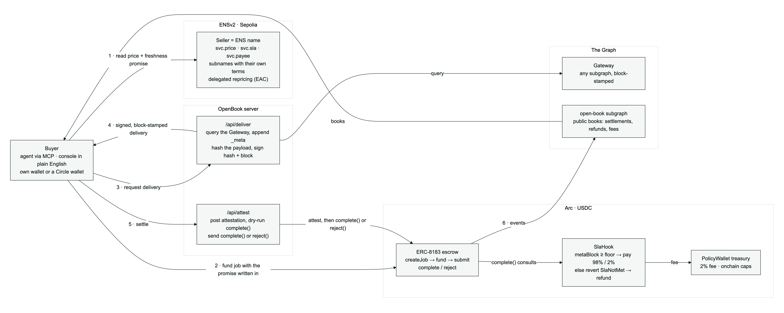
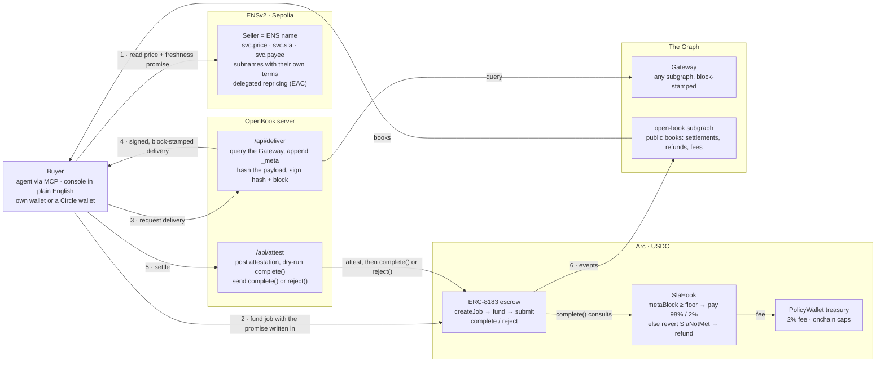

# OpenBook Architecture

OpenBook is the data marketplace for AI agents, with a freshness guarantee that enforces
itself. Sellers are ENSv2 names whose text records set a price and a freshness window.
A buyer pays USDC into an ERC-8183 escrow on Arc with that promise written into the job.
The delivery comes from The Graph gateway stamped with the block it was indexed at, and
the SlaHook compares that block with the promise before any payout: fresh, the seller is
paid and the protocol takes 2%; stale, `complete()` reverts and the escrow refunds the
buyer. Every settlement, refund and fee is indexed by the open-book subgraph into public
books.

## Reference flow (happy path)

1. **Resolve**: the buyer reads `openbook.eth`'s `svc.*` text records on Sepolia
   (ENSv2, UniversalResolverV2). Missing `price`/`sla`/`payee` is a hard fail:
   neither the MCP server, the CLIs, nor the frontend ever quotes a hard-coded
   value.
2. **Quote**: `get_quote` parses `svc.price` ("0.10 USDC/query") into 6-decimal
   USDC units and `svc.sla` (`{"maxBlockLag":50,"maxLatencyMs":2000}`) into the
   freshness floor and escrow deadline. Data-only, no writes.
3. **Pay**: the buyer funds an ERC-8183 job whose description commits the promise
   (`{"minBlock":N,"schemaHash":"0x…","maxLatencyMs":M}`). On the web app a Circle
   developer-controlled wallet does this server-side; with a browser wallet connected the
   wallet signs `createJob`, `approve` and `fund` and the seller's Circle wallet signs
   `setBudget`.
4. **Deliver**: `/api/deliver` runs the dataset query through the Gateway with the `_meta`
   fragment appended, hashes the payload and signs `payloadHash | metaBlock` (EIP-191); the
   seller wallet submits `payloadHash` onchain. The web app derives the floor at delivery
   time from the buyer's seconds window and the source chain's clock; the MCP server gates
   on block lag (`maxAge`) before it ever charges.
5. **Settle**: `/api/attest` verifies the job and the submitted hash onchain, posts the
   attestation to the hook, simulates `complete()`, and sends `complete()` (PaymentReleased,
   98% to the seller, 2% to the treasury) or `reject()` (Refunded) in the same request. A job
   nobody settles resolves to the buyer through `claimTimeout()` after its deadline.
6. **Books**: the open-book subgraph indexes OpenBook's own contract events (never raw USDC
   `Transfer`s) into settlements, refunds, fees and day-bucketed `DailyPnL` rows; the
   market page and `get_pnl` read them from Studio through the cached `/api/subgraph` proxy.

The recorded demo uses the live path only: a 0.1 s window fails honestly against the real
index lag. `scripts/stale-proxy.ts` is a local test aid that replays an old `_meta` snapshot;
it is not used in any submission run.

## Trust model (declared, not hidden)

- SLA conditions (freshness block, deliverable hash, deadline) are committed at
  payment time in the ERC-8183 job description; the deliverable hash is
  committed at `submit`.
- **The SLA is enforced onchain, not by the client.** `SlaHook.sol` (ours, an
  EIP-8183 `IACPHook`) is consulted before `complete()`: it re-derives the
  verdict from the committed attestation (`metaBlock >= minBlock` ∧ the proof
  covers the submitted `payloadHash`) and reverts `SlaNotMet(metaBlock, minBlock)`
  otherwise (the revert leaves no event; `Attested` is the observable trail). A seller
  therefore *cannot* take money for a stale delivery, even if the buyer's client is
  compromised or replaced; the refund path stays open.
- The verdict (`verify_delivery`) is deterministic open code:
  `metaBlock >= minBlock` and a well-formed payload hash. Anyone can re-run it.
- Timeout defaults to the buyer: `claimTimeout()` after the deadline. The seller
  cannot stall.
- Latency is buyer-attested reputation-layer only; never claimed as
  onchain-proven.
- The treasury is a policy wallet, not a free key: every withdrawal respects
  per-tx and per-block-day caps and an allowlist, and policy rejections are
  published onchain as `PolicyBlocked` events for the P&L subgraph to index.
- USDC is always displayed in the 6-decimal ERC-20 view, Arc's native-gas
  view is 18 decimals on the same balance; the two are never summed.
